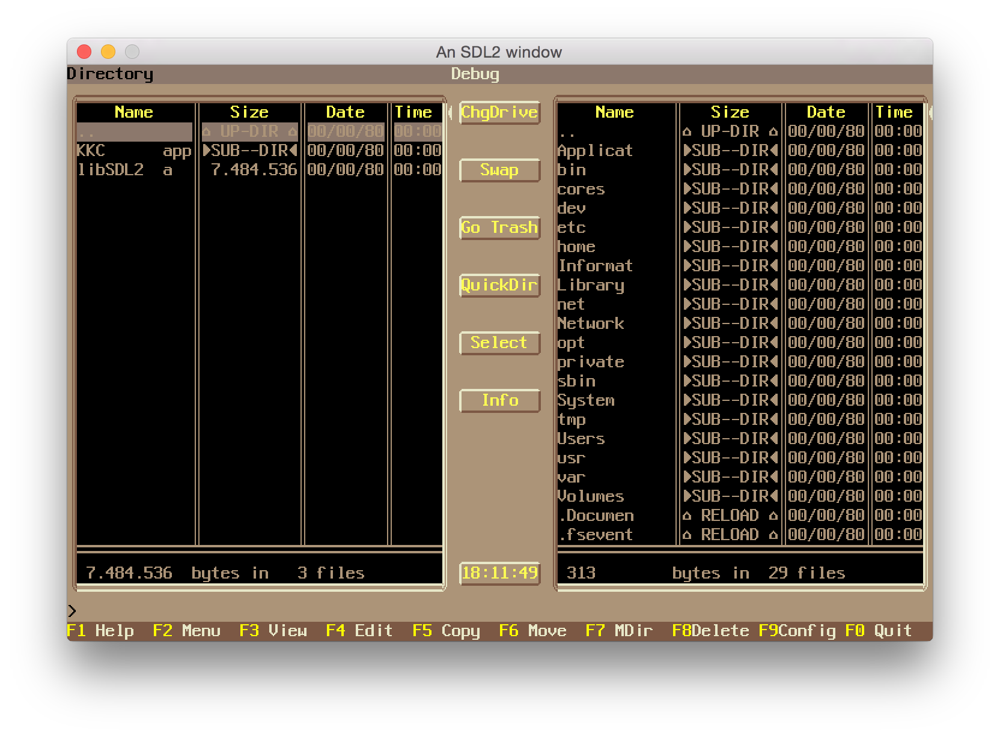

# Ketchup Killers Commander

[](https://travis-ci.org/travis-ci/travis-api) [](https://opensource.org/licenses/MIT)



Ketchup Killers Commander is a DOS/linux file manager created in 1997. It recognizes more than 170 files from their header and run their respective player. It has its own internal HTML, ANSI, binary and text viewer. 
It supports long filename under Win95 and could extract file from RAR, ZIP, ARJ and LHA archive. 
Many shortcut and user customization (palette, style, font, etc). Search function, and many other functions.

## Build instruction

``` 
make
```

## 
